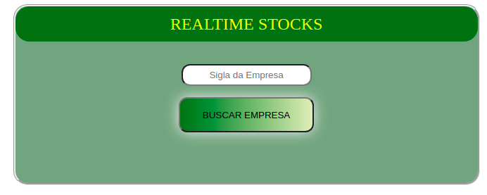
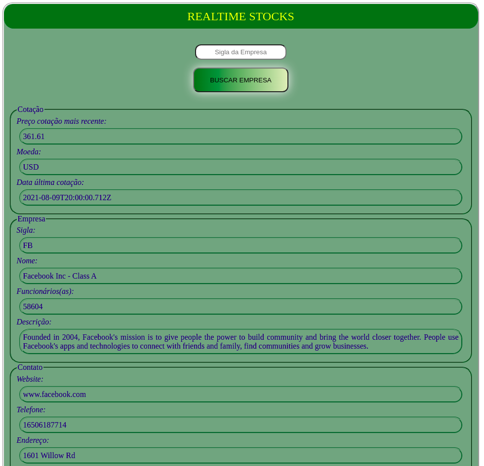

# Desafio - Back-end API IEX Cloud :computer:
- Construir uma aplicação que exibe o valor de ações através de chamadas de API e outras informações relevantes.

___
## :satellite: [Acesse aplicação web clicando aqui](https://realtime-stocks-web.herokuapp.com/) :computer:
___
## Sumário
1. [Objetivo](#objetivo-do-teste)
2. [Contexto](#contexto)
3. [Importante](#Importante)
4. [Requisitos técnicos](#requisitos-técnicos)
5. [Tecnologias](#tecnologias)
6. [Pré-requisitos](#pré-requisitos)
7. [Rodando o projeto localmente](#clone-o-repositório)
8. [Breve síntese da aplicação](#breve-síntese-da-aplicação)
9. [Demonstração da aplicação](#demonstração-da-aplicação)
10. [Autor](#autor)
___

<br>

## Objetivo do teste:
- O teste consiste em construir uma simples aplicação que exibe o valor de ações através de chamadas de API. Crie uma tela apenas com um input de texto que receberá um símbolo de ação (ex: aapl para Apple, fb para Facebook, twtr para Twitter) e retornará o último valor de ação da empresa, assim como outras informações relevantes. Além disso, você deve salvar todas as consultas e seus dados em um banco de dados (MySQL ou PostgreSQL), evitando que requisições repetidas. Sinta-se livre para utilizar quaisquer dependências que você desejar e auxiliar no desenvolvimento da aplicação.
___

<br>

## Contexto
Desenvolver uma aplicação para as seguintes situações:
- construir uma aplicação que exibe o valor de ações através de chamadas de API. 
- Criar uma tela com um input de texto que receberá um símbolo de ação (ex: aapl para Apple, fb para Facebook, twtr para Twitter).
- Retornar o último valor de ação da empresa.
- Retornar outras informações relevantes.
- Salvar todas as consultas e seus dados em um banco de dados (MySQL ou PostgreSQL).
- Evitar requisições repetidas.
- Utilizar quaisquer dependências que desejar e auxiliar no desenvolvimento da aplicação.


### Importante
  #### :money_with_wings: Preço das ações :money_with_wings:
  - As informações de ações foram requisitadas através do endpoint `quote` [aqui](https://iexcloud.io/docs/api/#quote). 
  - O desafio aponta o `latestPrice` como principal informação.

  #### :office: Detalhes da empresa
  - As informação mais relevantes da empresa foram requisitadas através do endpoint `company` [aqui](https://iexcloud.io/docs/api/#company).


### Requisitos técnicos
- Utilize PHP (Laravel) ou `Javascript (Node.js)` para construir o seu projeto! 
- Criar um `README.md` detalhado para realizar a execução do seu projeto.

<br>

___
> ## ...Desafio Finalizado :rocket::rocket::rocket:
___

<br>

## 🛠 Tecnologias 
As seguintes ferramentas foram usadas na construção do projeto `(Back-End e Front-End)`:
- JavaScript
- [Nodejs](https://nodejs.org/en/)
- [MySQL](https://www.mysql.com/)
- [Sequelize](https://sequelize.org/)
- [Express](https://www.npmjs.com/package/express)
- [Nodemon](https://www.npmjs.com/package/nodemon)
- [Dontenv](https://www.npmjs.com/package/dotenv)
- [Insomnia](https://insomnia.rest/)
- [node-postgres](https://node-postgres.com/)
- [Heroku](https://www.heroku.com/)
- [ReactJS](https://reactjs.org)
- [Git](https://git-scm.com)
- [GitHub Pages](https://pages.github.com/)
- [Axios](https://www.npmjs.com/package/axios)
- [Sass](https://sass-lang.com/)

<br>

### Pré-requisitos
Antes de começar, você vai precisar ter instalado em sua máquina as seguintes ferramentas:
- [Git](https://git-scm.com)
- [Node.js](https://nodejs.org/en/)
- [ReactJS](https://reactjs.org)

Além disto é bom ter um editor para trabalhar com o código como:
- [VSCode](https://code.visualstudio.com/)

E para testar a aplicação em back-end algo como: 
- [Insomnia](https://insomnia.rest)
___

<br>

## 🎲 Rodando o projeto localmente
### Clone o repositório:
```
git clone https://github.com/CassioRubens-CR/API-call-company-stock-project.git
```

### Acesse a pasta `Back-End` do projeto e instale as dependências:
```
npm install
```

### Crie/Altere o arquivo `.env` de acordo com as configurações do seu MySQL
```json
MYSQL_USER=SEU_USUARIO
MYSQL_PASSWORD=SUA_SENHA
MYSQL_SCHEMA=NOME_DO_SEU_DB
HOSTNAME=LOCALHOST
API_TOKEN_IEXJS=SEU_TOKEN
```
OBS: Será necessário realizar o cadastro no [IEX Cloud](https://iexcloud.io/) para ter acesso ao token da `API_TOKEN_IEXJS`. 


### Execute a aplicação em modo de desenvolvimento
```
npm run dev
```
#### O servidor inciará na porta:3001 - <http://localhost:3001>

<br>

### Acesse a pasta `Front-End` do projeto e instale as dependências:
```
npm install
```

### Crie/Altere o arquivo `.env` de acordo com as configurações do seu localhost:
```
REACT_APP_BASE_API_URL=http://localhost:3001
```

### Execute a aplicação
```
npm start
```
#### O servidor inciará na porta:3001 - <http://localhost:3000>
___

<br>

## Breve síntese da aplicação 


### Rotas:
> O filtro do endpoint quote HTTP Request `GET` `.../stock/{symbol}/quote/{field}` retorna:
```json
{
  'symbol',
  'companyName',
  'latestPrice',
  'latestUpdate',
  'currency'
}
```

> O filtro do endpoint company HTTP Request `GET` `.../stock/{symbol}/company` retorna:
```json
{
  'website',
  'employees',
  'address',
  'address2',
  'state',
  'city',
  'zip',
  'country',
  'phone',
  'description',
}
```
> Todas as informações são gravada no Banco de Dados `MySQL`.

> Quando o cliente realiza uma pesquisa, a aplicação faz primeiro a requisição junto ao banco de dados, evitando requisições repetidas, salvo o `latestPrice` e `latestUpdate`, pois os mesmo são atualizados em tempo real, em razão da regra do negócio de ações.





___

<br>

> # Demonstração da aplicação

### :satellite: Publicação do `Back-End e Front-End` em um serviço cloud de hospedagens :computer:

- [Acesse aplicação completa clicando aqui](https://realtime-stocks-web.herokuapp.com/)
___

<br>

### Autor
### :black_nib: Cássio Rubens 🚀
- [Portfólio](https://cassiorubens-cr.github.io/portfolio/)
- [GitHub](https://github.com/CassioRubens-CR)
- [Linkedin](https://www.linkedin.com/in/cássio-rubens)
